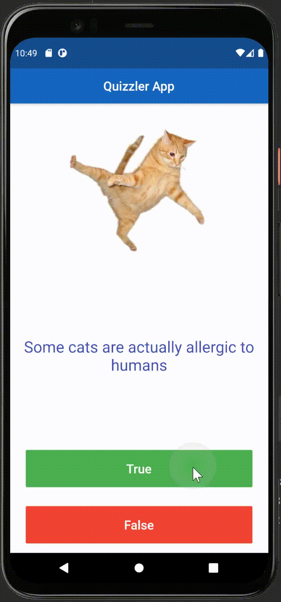

# Quizzler ❓

## Objectives

Reviewing Stateful and Stateless Widgets as well as learning about the fundamental building blocks of Object Oriented Programming (OOP) - Classes and Objects. 

## What I created 

A quiz app that tests your general knowledge. 

## What I have learnt

- Modularising your code into separate classes.
- Dart classes and objects.
- Using class constructors.
- Extracting Widgets to refactor your code.
- private and public modifiers in Dart.
- How to use Dart lists.
- The difference between var, const and final.

